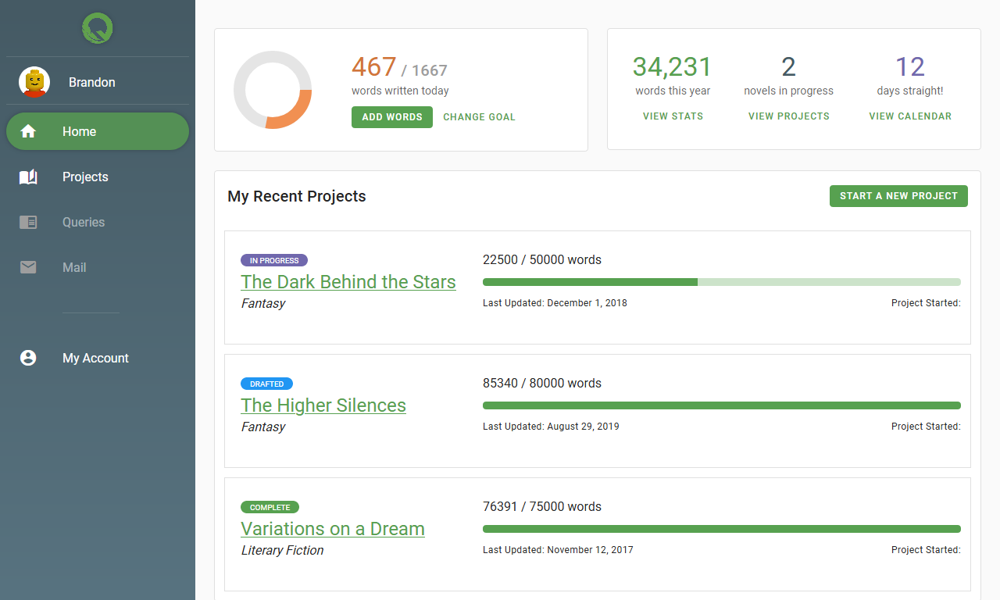
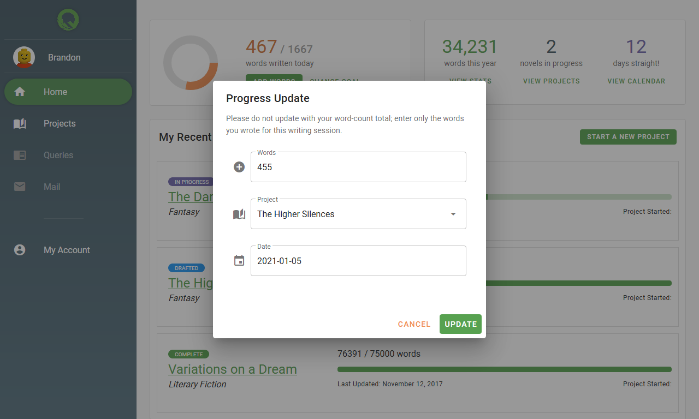

# Quill Driver

This is the front end project for a tool called Quill Driver (originally called "ntrack"), a project management tool for writers.

Quill Driver lets you manage and track your progress for writing novels, short stories, essays, etc., based on the premise that real achievement is through continuous, small efforts instead of sparse, massive pushes.

## Overview & Current Status

Quill Driver is currently just a "dummy" front-end, set up to learn Vue.js and Quasar, and to scaffold designs and iterate quickly over them.

## Planned Features
* Writing Project Management
  * Word count, page count, hourly tracking
  * Writing statistics over time
  * Automatic goal calculation
* Query Management
  * Inbox / outbox for tracking queries sent to editors or agents
  * Query status updates to view progress toward getting published
